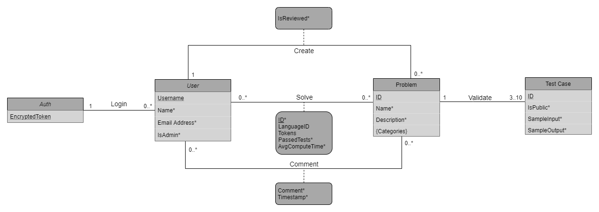

# AlgoLearn Database Schemata

## Conceptual Schema

## Logical Schema

**User**(
<ins>Username</ins>,
Name*,
Email*,
isAdmin\*
)

**Problem**(
<ins>ProblemID</ins>,
Name*,
Poster*,
IsReviewed*,
Description*
)

- Poster references User

**Test Case**(
<ins>TCID</ins>,
Problem*,
IsPublic*,
SampleInput*,
SampleOutput*
)

- Problem References Problem

**Solution**(
<ins>SolutionID*</ins>,
Solver*,
Problem*,
Code*,
PassedTests*,
CompTime*,
Tokens\*
)

- Solver References User
- Problem References Problem

**Comment**(
<ins>CommentID</ins>,
Commenter*,
Problem*,
Timestamp*,
Comment*
)

- Commenter References User
- Problem References Problem

**Category**(
<ins>CategoryID</ins>,
Problem*,
Name*
)

- Problem References Problem

**Auth**(
<ins>Username</ins>,
EncryptedToken
)

- Username references User
